# 99 Days of Coding Challenge - App Development 🚀  
**Challenger:** Md Siamul Islam Soaib  
**Sector:** App Development  
**Challenge Organizer:** DIU CPC  
**Challenge Duration:** November 1, 2024 - February 8, 2025  

---

## 📅 Challenge Progress  
এই সেকশনে প্রতিদিনের কাজের সংক্ষিপ্ত বিবরণ রাখা হয়েছে। আমি প্রতিদিন যা শিখেছি তার ওভারভিউ এখানে দেওয়া হয়েছে, বিস্তারিত প্রোজেক্ট পাবেন আমার ফোল্ডারগুলতে।

<details>
<summary>### Day 1: [01 Nov 2024]</summary>

**Today's Learning:**  
- আজকের দিনের ফোকাস ছিল অ্যাপ ডেভেলপমেন্ট এর বেসিক টপিক নিয়ে কাজ করা এবং ইনপুট ফিল্ড নিয়ে কাজ করা। ড্রপডাউন কিভাবে তৈরি এবং কাজ করে তা শিখেছি।  
 
**Project/Code Update:**  
```dart
DropdownButton<String>(
  value: conversionType,
  items: <String>[
    "Celsius to Fahrenheit",
    "Fahrenheit to Celsius"
  ].map((String value) {
    return DropdownMenuItem<String>(
      value: value,
      child: Text(value),
    );
  }).toList(),
  onChanged: (String? newValue) {
    setState(() {
      conversionType = newValue!;
    });
  },
)
```
- ইনপুট ফিল্ডে ইনপুট টাইপ নির্বাচন কিভাবে করতে হয় এবং ড্রপডাউন কিভাবে কাজ করে তা শিখেছি।

**Screenshot:**  
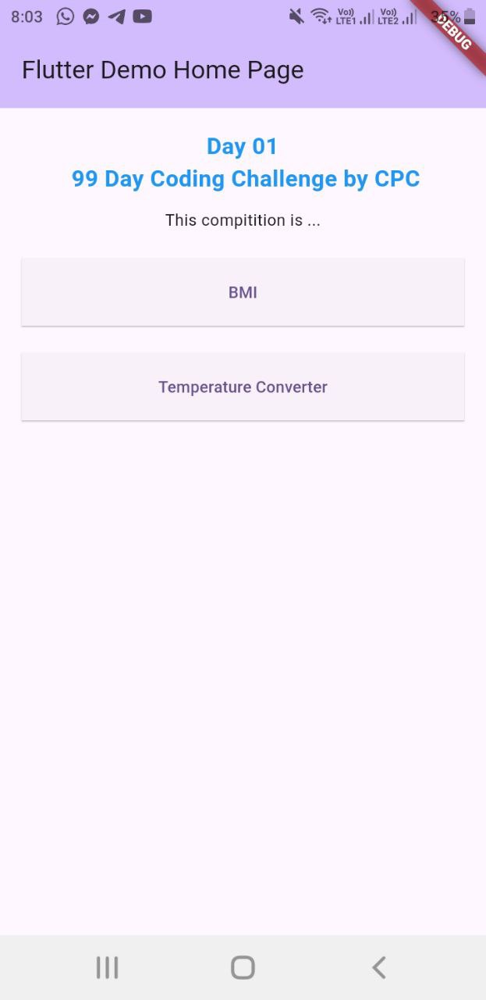 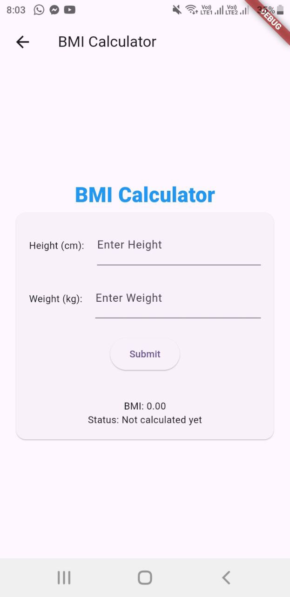 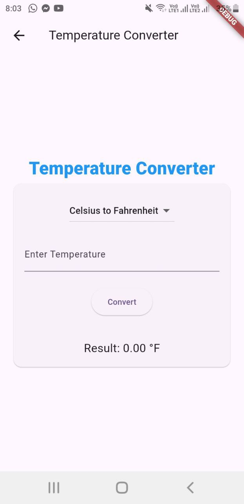

</details>

<details>
<summary>### Day 2: [02 Nov 2024]</summary>

**Today's Learning:**  
- আজকের দিনের ফোকাস ছিল UI ডিজাইন এবং Flutter দিয়ে নতুন একটি স্ক্রিন তৈরি করা। গতকাল করা বিএমআই অ্যাপকে আরও উন্নত করা হয়েছে।

**Project/Code Update:**  
- প্রোজেক্টের জন্য একটি হোম পেজ ডিজাইন করেছি, যেখানে আইকন, স্লাইডার এবং টেক্সট যুক্ত করেছি।

**Screenshot:**  
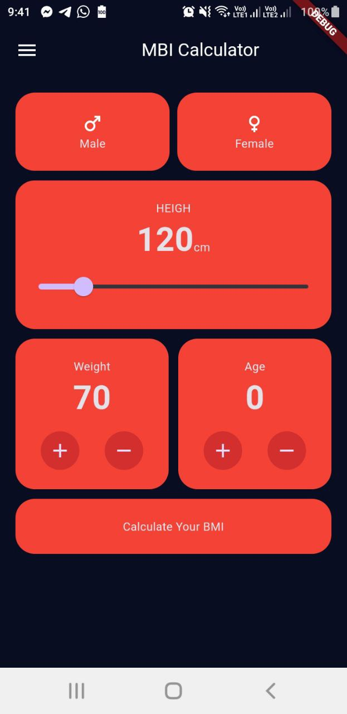  
**Update:** The home page is now fully set up with icons and text, and the BMI app updates are complete!  
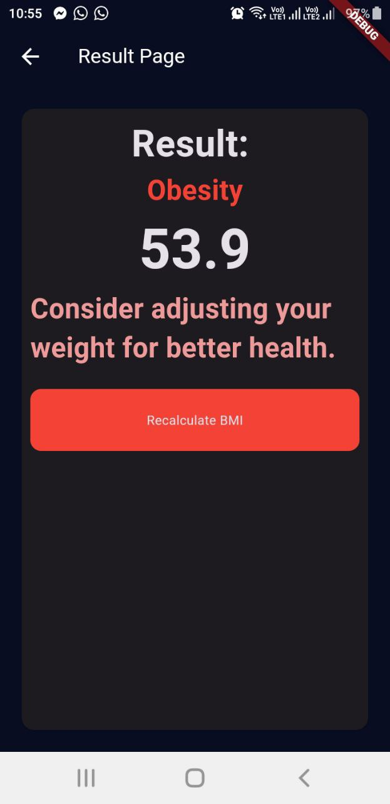

</details>

<details>
<summary>### Day 3: [03 Nov 2024]</summary>

**Today's Learning:**  
- আজকের দিনের ফোকাস ছিল আমার আগের আবহাওয়া অ্যাপটিকে আরও মডিফাই করা। লোকেশন বাটনে ক্লিক করলে কারেন্ট লোকেশন অনুযায়ী আবহাওয়া দেখাবে।

**Project/Code Update:**  
- REST API নিয়ে কাজ করেছি, লোকেশন থেকে শহরের নাম বের করেছি।

**Screenshot:**  
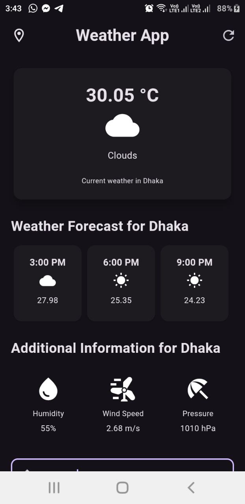

</details>

<details>
<summary>### Day 4: [04 Nov 2024]</summary>

**Today's Learning:**  
- আজকের দিনের ফোকাস ছিল একটি টু-ডু অ্যাপের ইন্টারফেস তৈরি করা এবং এটিকে কার্যকর করা। *শিখতে হবে কিভাবে ডিভাইসে ডেটা সেভ রাখা যায়।*

**Project/Code Update:**  
- ডার্টের লিস্ট নিয়ে কাজ করেছি, লিস্ট থেকে ডেটা অ্যাক্সেস এবং পরিবর্তন করার কৌশল শিখেছি।  

**Screenshot:**  
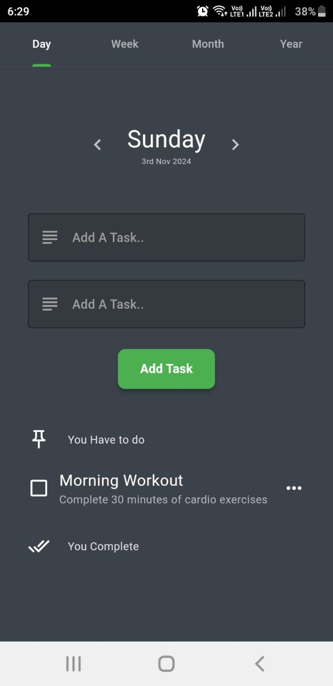 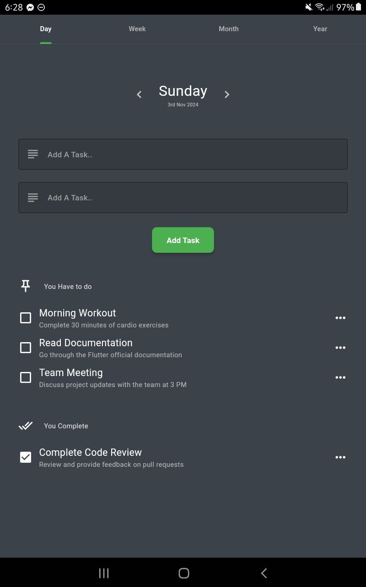

</details>

<details>
<summary>### Day 5: [05 Nov 2024]</summary>

**Today's Learning:**  
- আজকের দিনের ফোকাস ছিল টু-ডু অ্যাপের UI উন্নত করা। *শিখতে হবে কিভাবে ডিভাইসে ডেটা সেভ রাখা যায়।*

**Project/Code Update:**  
- SingleChildScrollView নিয়ে কাজ করেছি এবং Row overflow সমস্যার সমাধান করেছি।

</details>

<details>
<summary>### Day 6: [06 Nov 2024]</summary>

**Today's Learning:**  
- আজকের দিনের ফোকাস ছিল ডিভাইসে ডেটা সেভ করার প্রক্রিয়া শিখা।  

**Project/Code Update:**  
- Shared Preferences নিয়ে কাজ করেছি।  

**Screenshot:**  
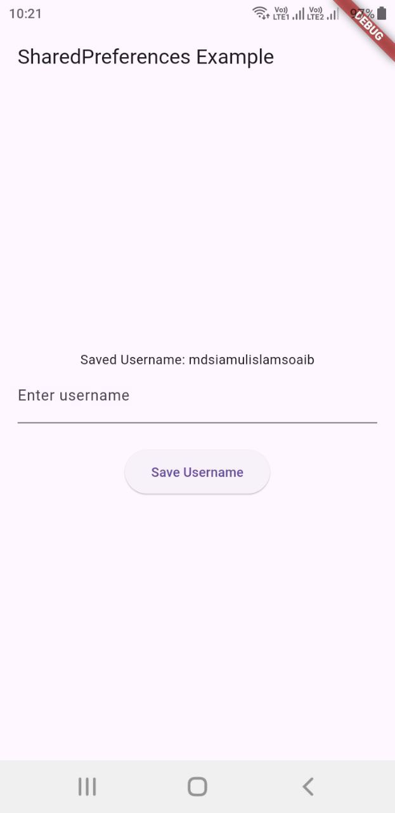

</details>

<details>
<summary>### Day 7: [07 Nov 2024]</summary>

**Today's Learning:**  
- আজকের দিনের ফোকাস ছিল ডিভাইসে ডেটা সেভ করার প্রক্রিয়া এবং ইউজার এক্সপেরিয়েন্স বৃদ্ধির জন্য সেটি ব্যবহার করা।  

**Project/Code Update:**  
- Shared Preferences নিয়ে আরও উন্নত কাজ করেছি, যা কিছুটা অথেনটিকেশন এর মতন কাজ করে।  

**Screenshot:**  
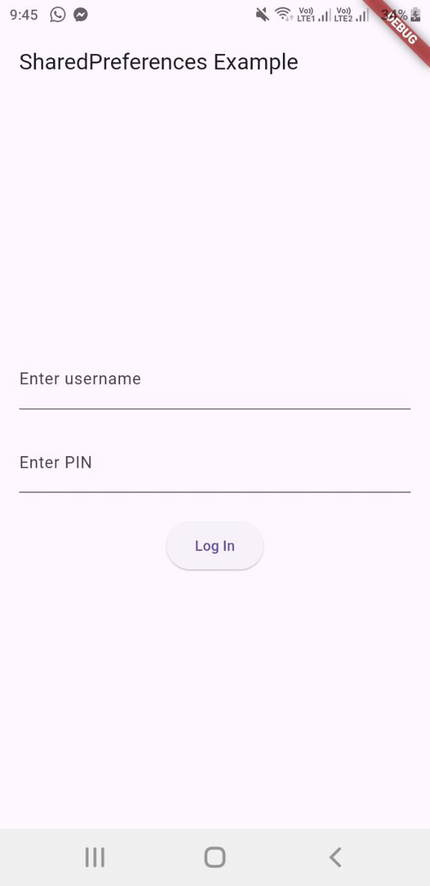

</details>

<details>
<summary>### Day 8: [08 Nov 2024]</summary>

**Today's Learning:**  
- আজকের দিনের ফোকাস ছিল Shared Preferences এর বিভিন্ন ফিচার এক্সপ্লোর করা।  

**Project/Code Update:**  
- Shared Preferences দিয়ে অ্যাড করা, ডিলেট করা, ইত্যাদি কাজ করেছি।  

**Screenshot:**  
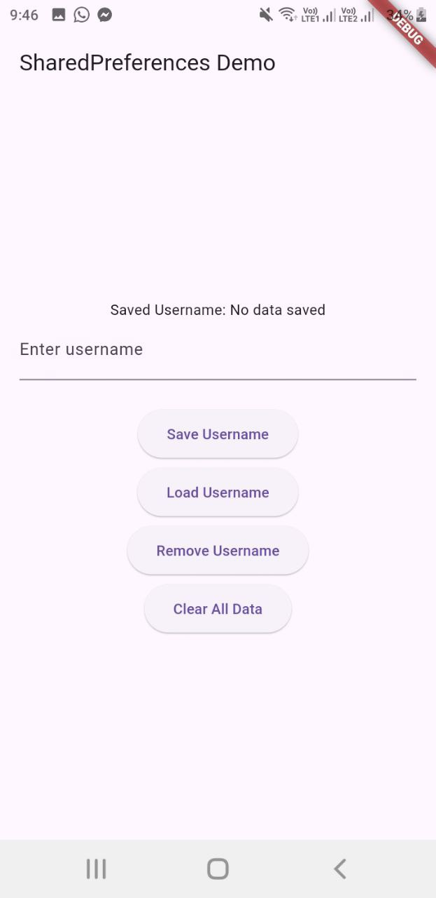

</details>

<details>
<summary>### Day 9: [09 Nov 2024]</summary>

**Today's Learning:**  
- আজকের দিনের ফোকাস ছিল সম্পূর্ণ একটি টুডু অ্যাপ তৈরি করা। 

**Project/Code Update:**  
- Shared Preferences দিয়ে অ্যাড করা, ডিলেট করা, ইত্যাদি কাজ করেছি।  

**Screenshot:**  
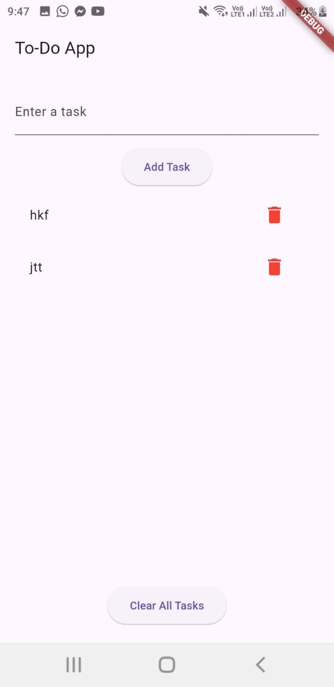

</details>

<details>
<summary>### Day 10: [10 Nov 2024]</summary>

**Today's Learning:**  
- আজকের দিনের ফোকাস ছিল আমাদের পূর্বের করা একটা অ্যাপ যেন তার ডেটা গুলো ডিভাইসে সেভ করতে পারে সেটি নিশ্চিত করা। 

**Project/Code Update:**  
- Shared Preferences দিয়ে সেভ করার প্রক্রিয়া সম্পন্ন করেছি।  

**Screenshot:**  
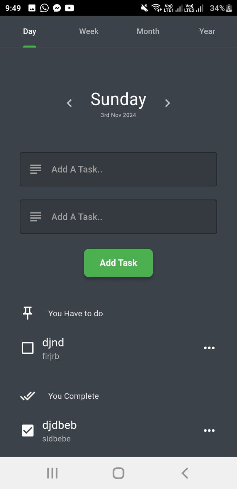

</details>

<details>
<summary>### Day 11: [11 Nov 2024]</summary>

**Today's Learning:**  
- আজকের দিনের ফোকাস ছিল একটি টাস্ক ম্যানেজমেন্ট অ্যাপে Shared Preferences ব্যবহার করে টাস্ক যুক্ত করা, এডিট করা, এবং মুছে ফেলার সিস্টেম তৈরি করা। এই প্রজেক্টটি আগেই শুরু হয়েছিল, এখন এটি ব্যবহারের জন্য প্রস্তুত। আপনি এই লিঙ্ক থেকে ডাউনলোড করে ব্যবহার করতে পারবেন: [AppTest/TODOApp](AppTest/TODOApp)

**Project/Code Update:**  
- একটি টাস্ক অ্যাপ তৈরি করেছি যেখানে ব্যবহারকারী নতুন টাস্ক অ্যাড করতে পারে, টাস্ক এডিট করতে পারে এবং প্রয়োজনে মুছে ফেলতে পারে। ডেটা Local Storage-এ সংরক্ষণ করা হয়েছে।

**Screenshot:**  
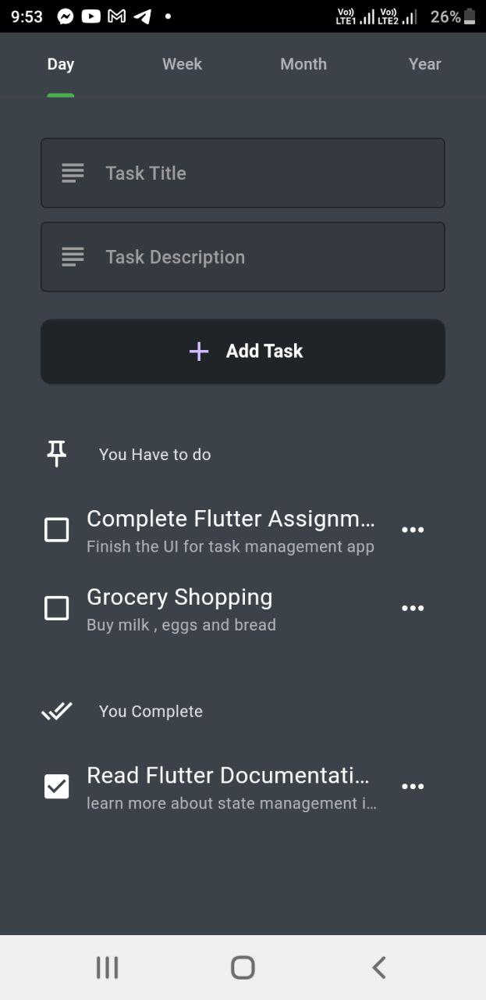 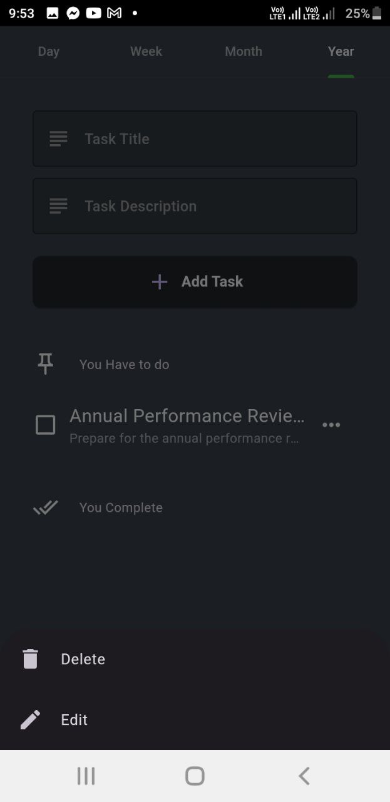 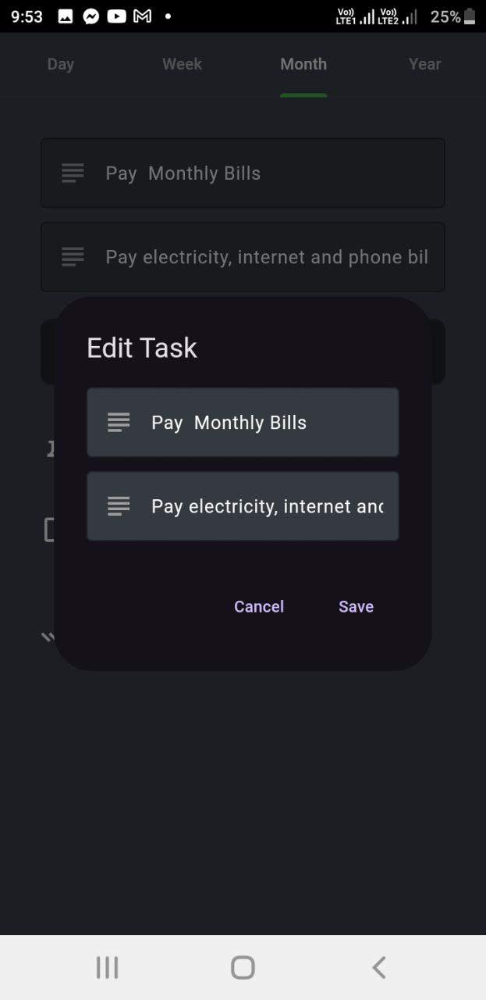

*Note:* আজকের অ্যাপে ChatGPT থেকে কিছু সাহায্য নিয়েছি। প্রথমে কোড তৈরি করেছি এবং AI-এর সাহায্যে সেটি উন্নত করেছি এবং এতে কি পরিবর্তন করে সেটি শিখেছি।

</details>

<details>
<summary>### Day 12: [12 Nov 2024]</summary>

**Today's Learning:**  
- আজকের দিনের ফোকাস আমার আগের করা একটা অ্যাপ এ এপিআই যুক্ত করে প্রানবন্ত করে তোলা । আপনি এই লিঙ্ক থেকে ডাউনলোড করে ব্যবহার করতে পারবেন: [AppTest/iom](AppTest/iom/)

**Project/Code Update:**  
- এখানে আমি এপিআই ব্যাবহার এবং ম্যানেজ সিখেছি 

**Screenshot:**  
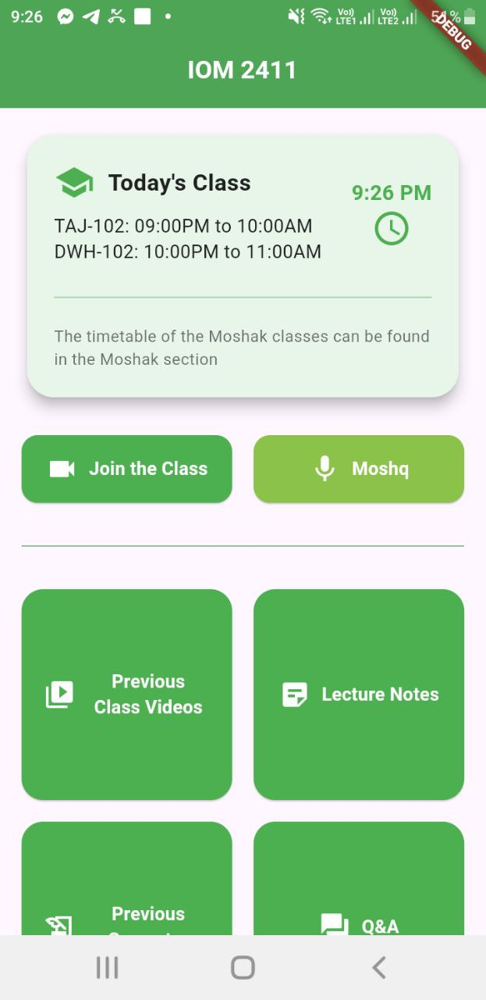 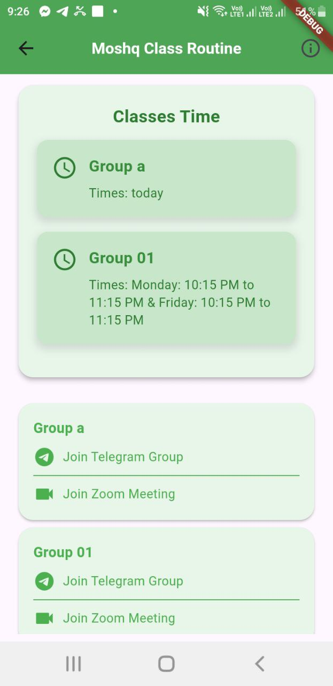 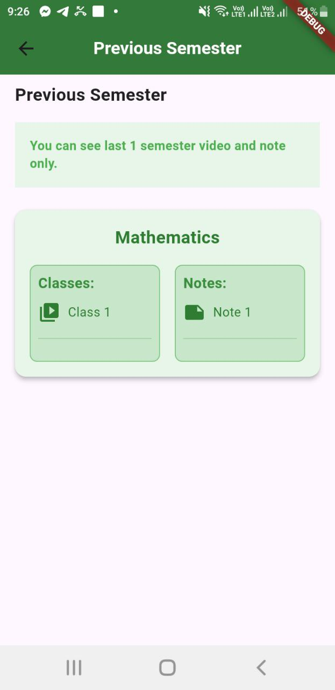 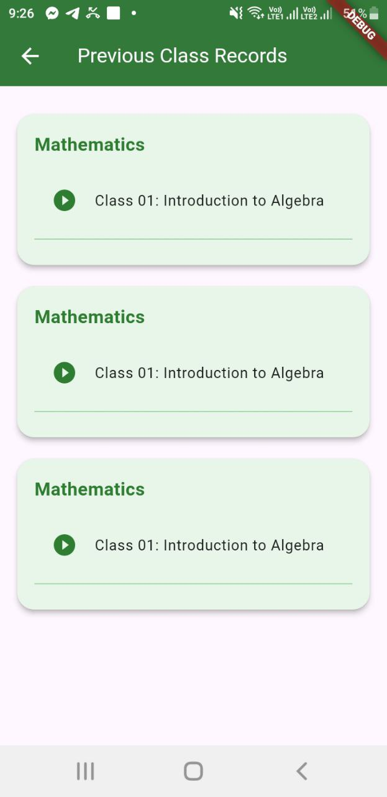

*Note:* আজকের অ্যাপে ChatGPT থেকে কিছু সাহায্য নিয়েছি। প্রথমে কোড তৈরি করেছি এবং AI-এর সাহায্যে সেটি উন্নত করেছি এবং এতে কি পরিবর্তন করে সেটি শিখেছি।

</details>

<details>
<summary>### Day 13: [13 Nov 2024]</summary>

**Today's Learning:**  
- আজকের দিনের ফোকাস ফায়ারবেস অথেনটিকেশন সিস্টেম ব্যাবহার শিখা । 

</details>

<details>
<summary>### Day 14: [14 Nov 2024]</summary>

**Today's Learning:**  
- আজকের দিনের ফোকাস ফায়ারবেস অথেনটিকেশন সিস্টেম ব্যাবহার শিখা । একই সাথে লগ ইন শিখা । বি দ্রঃ গতকাল ই দুইতা সিখেছিলাম আমরা । আজকেও ও সেটাই আবার নতুন করে সিখলাম ।  

</details>

---
## 🏆 Weekly Project
- 
  
  
  Day 11 is the weekly project

## 🏆 Weekly Summary 

**Week 1 Summary:**  
- Flutter এর বেসিক UI তৈরির কৌশল শিখেছি।
- নতুন একটি স্ক্রিন ডিজাইন করেছি এবং প্রোজেক্টে যুক্ত করেছি।
- Repo: [GitHub Link to Repo](https://github.com/mdsiamulislam/YourRepoName-99DaysWithCPC)  

---  

## 📸 Gallery  
   

---

## 🔗 Useful Links  
- [Flutter Documentation](https://flutter.dev/docs)  
- [Dart Language Guide](https://dart.dev/guides)  

---  

## 💡 Reflections  
- **Challenge Observations:** এই চ্যালেঞ্জ আমাকে নিয়মিতভাবে কোড করতে এবং নতুন বিষয় শিখতে অনুপ্রাণিত করছে।
- **Next Week Goals:** আগামী সপ্তাহে আমি Firebase Authentication নিয়ে কাজ করতে চাই।  

---

## 🔥 Motivation  
এই চ্যালেঞ্জের মাধ্যমে প্রতিদিন কিছু নতুন শিখে নিজের দক্ষতা বৃদ্ধি করার চেষ্টা করছি।